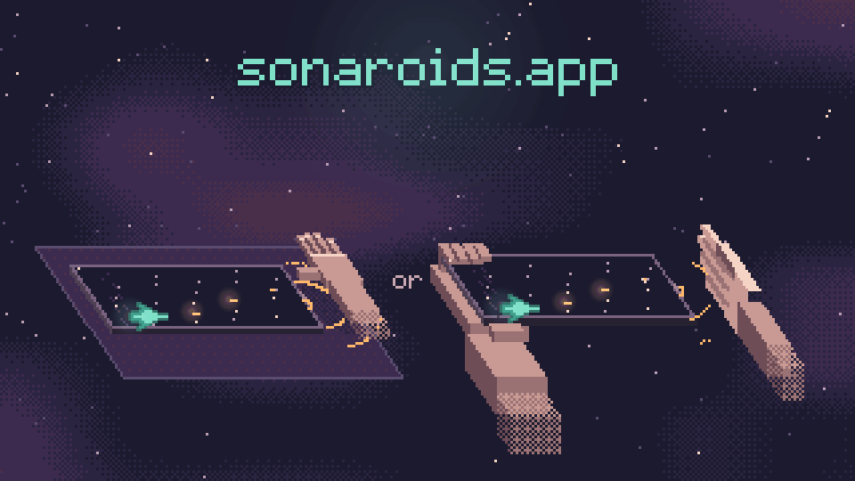

# Sonaroids

**English** · [Русский](README.ru.md)

A tiny retro space game for phones that you steer with your palm — **without touching the screen**.

<p align="center"></p>

The phone lies flat on the table. It plays an inaudible ultrasonic tone through its own speaker and listens to the echo with its own microphone. The height of your palm beside the phone becomes the height of your ship. The ship fires on its own — you only choose where to be.

**▶ Play: [sonaroids.app](https://sonaroids.app)** — best on iPhone, added to the Home Screen.

## How to play

1. Turn the phone sideways and lay it on the table, screen up.
2. Set the **media volume** to 30–70% (the silent switch doesn't matter).
3. Allow the microphone. Take your hand away for a moment — the game listens to the empty room.
4. Wave your palm up and down **5–15 cm above the table**, beside the phone. The game fits the screen to your range, then shows the real ship following your palm — check the top and the bottom, and play (or recalibrate).
5. Fly: dodge the rocks, stay in the middle for more points, catch power-ups.

A game lasts a few minutes: the pace keeps growing, and a hand held in the air gets tired too — that's part of it.

## The game

- **Rocks** split into smaller ones when hit: large → two medium → two small.
- **Points by height:** the middle of the screen ×3, then ×2, the edges ×1; plus a **streak** multiplier for hits in a row (up to ×4).
- **Power-ups** — fly into them: shield (takes one hit), triple shot, slow motion (once the game has sped up), and a heart — an extra life (only after you've lost one, never above three).
- **Saucers:** a large one from level 2, a small one that aims at you from level 4. They sidestep when you line up with them; the large one takes two hits.
- **Pause menu:** go on, start over (straight away or recalibrate), end the game, exit.
- **High scores:** today, this week, all time. Every game is on a freshly generated layout. The first time a game makes the table, the game asks for a name (Latin letters, digits, `_`).

In flight the screen shows only the score and, small in the top corner, sonaroids.app — no labels, no numbers popping up. The picture is drawn at low resolution in whole pixels, with soft light on top; graphics, sounds and the 5×7 pixel font are all made in code.

## Phones

It works best on **iPhone**. On **Android** (Chrome) it depends on the phone's speaker and microphone: many phones pass the 18–20 kHz band poorly, and control can be noticeably worse or not work at all. Tried so far: OnePlus 13 — poor; Redmi Note 10 — the palm is heard only at the front-camera end, and not precisely. The game learns which end of the phone your hand should be at, and says so if it can't hear the palm. Details: `docs/design.md`, section 2.

## How the sonar works, in short

- The probe is a periodic multi-tone signal: 512 samples at 48 kHz, 23 tones from 18.4 to 20.4 kHz. An AudioWorklet delivers the microphone stream sample-exact, so the echo picture is computed coherently every 10.7 ms.
- Palm **motion** comes from the phase change of the echo (sub-millimetre, but it drifts); palm **position** comes from where the echo sits compared with the empty room (noisy, but it doesn't drift). The two are fused: motion drives the ship, position keeps it from wandering.
- The echo is measured against the direct sound's own level; on phones whose speaker fades toward 20 kHz the band is equalized; if the phone drops a stretch of input, the direct sound is found again.
- No separate calibration: before each game you take your hand away (the empty room), then wave — and the screen is fitted to your range.

Measurements, experiments and what didn't work: `lab/HANDOVER.md` (Russian).

## High scores and fair play

A game is sent to the server not as a score but as the game itself: the layout number and the palm height at every step (a few KB). The flight is deterministic — fixed 60 Hz steps, a seeded random generator, no transcendental functions — so the server replays it with the very same code (`src/13_core.js`) and stores only a score that repeats. The player is a random key kept on the phone; the server stores only its hash. With each game goes a short note on the phone — iOS or Android, the kind of browser, the model on Android, how well it heard the probe — to see where the sonar works; no user agent string or IP is stored. The server is plain Node + SQLite: `server/`.

## Repository

| path | what's inside |
|---|---|
| `src/` | the game's source in numbered parts; `build.py` joins them into one file, `game/play/index.html` |
| `game/` | the published site: `index.html` sends visitors straight into the game, `play/` — the game (built file, icons, manifest, service worker), `proto/` — the style prototype (unlinked), `font.js`, `robots.txt` |
| `server/` | the high-score server (api.sonaroids.app): `server.js`, backups, systemd unit, Caddy/nginx configs. Install: `server/README.md`, in Russian `docs/ru/server.md` |
| `tests/` | the game's and the server's checks: `sh tests/run.sh` |
| `lab/` | the sonar lab: the test app `lab/app/sonar_lab3.html` (published unlinked at `/lab/sonar_lab3.html`), its sources and offline benches; notes in Russian |
| `font/` | the 5×7 pixel font (Latin and Cyrillic): `font5x7.txt` is the drawing, `make_font.py` packs it into `game/font.js` |
| `promo/` | the GIF above, drawn by the game's own code: `node promo/make_gif.js && python3 promo/make_gif.py` |
| `docs/` | the design document `design.md` (Russian original in `docs/ru/`), the server install guide in Russian |

### The game's code (`src/`)

| part | what it does |
|---|---|
| `00_head.html`, `99_end.html` | the page around the script |
| `10_worklet.js`, `11_dsp.js` | microphone frames and the echo processing (DSP2) — the same code as in the lab |
| `12_tune.js` | fitting the screen to the waved palm range (pure, tested in Node) |
| `13_core.js` | the flight and the rules, deterministic, with the rules tag the server checks |
| `20_sonar.js` | speaker and microphone: probe, side check, auto level, getting ready; `Sonar.simulate()` feeds synthetic frames in tests |
| `21_log.js` | setup and game logs (WAV + JSON) for analysis with the lab's tools |
| `22_sfx.js` | event sounds, all below 6 kHz so they stay out of the probe's band |
| `23_net.js` | the high-score client: sends a game, the name, reads the tables |
| `30_lang_en.js`, `31_lang_ru.js` | interface strings |
| `40_gfx.js`, `41_sprites.js`, `42_guide.js`, `49_main.js` | drawing, sprites, first-launch pictures, screens and the game loop |

## Building and checks

```sh
python3 build.py                 # src/ → game/play/index.html (python3 font/make_font.py after changing the font)
python3 build.py --icons         # redraw the home-screen icons (needs Pillow)
sh tests/run.sh                  # the game and the server
cd lab && sh tools/run_all.sh    # the sonar lab
```

Node 22.13+ (the server uses `node:sqlite`) and Python 3. The screen and full-game checks run the game in headless Chromium with a synthetic microphone and a fake high-score server; they need Playwright and are skipped without it. GitHub Actions runs the checks on every push to `main` and publishes the site only if they pass.

The game's version is in `VERSION` (shown on the title screen and written into the logs); `CHANGELOG.md` says what each version changed. When a change alters play, the rules tag in `src/13_core.js` changes too, and the server is updated together with the site.

## License

MIT — see `LICENSE`.
