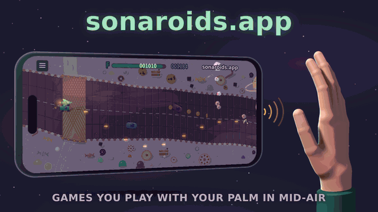

# sonaroids.app

**English** · [Русский](README.ru.md)

<p align="center"></p>

**Games you play with your palm in mid-air.** You never touch the screen: the phone plays an inaudible ultrasonic tone through its own speaker, listens to the echo with its own microphone and works out how far your palm is. That distance becomes the height of your ship or your car. No camera, no extra hardware, nothing to install — it is a web page.

**▶ Play: [sonaroids.app](https://sonaroids.app)**
- **iPhone:** open it in Safari and add it to the Home Screen.
- **Android:** best in the app — [download the APK](https://github.com/neokrasav4ik/sonaroids/releases/latest/download/sonaroids.apk) (the link is on the games' screen too).

## The games

<p align="center"></p>

### SonaFly — a space shooter

The ship fires on its own; all you choose is where it is.

- **Rocks** split when hit: large → two medium → two small.
- **Points** depend on height: the middle of the screen ×3, then ×2, the edges ×1. Hits in a row add a **streak** multiplier, up to ×4.
- **Power-ups** — fly into them: a shield (takes one hit), triple shot, slow motion (once the game has sped up), a heart (an extra life, after you've lost one).
- **Saucers:** a large one from level 2, a small one that aims at you from level 4. Line up with them and they sidestep.
- **Six skins:** space, fairy tale, vector 80s, neon, notebook, retro LCD — each in **HD** or in **pixels**. In every skin things are drawn exactly the size the game counts them.

### SonaRace — a race along a winding road

<p align="center"> </p>

The car drives itself and slowly speeds up; your palm steers it across the road.

- **Fuel** runs out as you go. Pick up the bottles marked **F** (the pumps in the notebook); when the fuel is gone, so is the race.
- **Coins** (stars in the notebook): a whole line of them is worth more. Every car you pass scores too.
- **Knocking into a car** slows you down and costs fuel. The verge slows you too, and so does a syrup puddle (an ink blot in the notebook) — though just touching one with an edge is forgiven.
- **Gifts:** a magnet pulls coins and gifts in, a shield bubble takes one knock. The **super gift** — turbo, magnet and shield at once — comes exactly once in every eight gifts.
- **Two skins:** the candy land and the notebook, each in HD or in pixels. Steering: along the road (the default — the car keeps its place across the road through the bends) or by height.

## How to play

There are two ways:

| on the table | in your hand |
|---|---|
| The phone lies sideways, screen up; your palm moves up and down **5–10 cm above the table** beside it | The phone is in one hand; the other palm, edge down, moves **5–15 cm from the end with the charging port** |

1. Set the **media volume** to 20–30% (40–60% on iPhone). If the game says the phone can't hear its own sound, turn off silent mode — it can mute the game.
2. Pick the probe. **Wide** gives cleaner control, but children and pets may hear it. **Normal** is silent but slightly rougher. The game asks before every game.
3. Allow the microphone and take your hand away for a moment: the game learns how the empty room sounds.
4. Wave your palm. Nearer the phone — the ship goes lower; farther — higher. Don't cover the speaker or the microphone. The game fits the screen to your range, then shows the real ship (or car) following your palm. Check the top and the bottom, and play.

A game lasts a few minutes: the pace keeps growing, and a hand held in the air gets tired too — that's part of it.

**The pause** in both games: go on, start over (straight away or with a new fit), end the game, exit to the menu. Beside them are the skin, the graphics (HD or pixels) and the sounds "- SOUNDS ▮▮▮▮▮▮▯▯ +": eight levels, a tap in the middle switches them off and on. The skin and the graphics can be changed in the middle of a game. If the game's own sounds get too loud for the microphone, it turns them down by itself.

**If something's wrong:** a tap on the version on the games' screen reloads the page, and a long press opens "Logs". They record what the phone heard and can be attached to an issue.

## Phones

**iPhone** plays well in Safari.

On **Android** a lot depends on the phone itself: how well its speaker and microphone pass 16–20 kHz. In a browser the page can't choose which microphone records, and doesn't know how loud the phone plays. That is what **the app** (`android/`) is for. Inside it shows the same site, so the games in it are always current, but it records and plays the sound itself:
- before a game it tries the built-in microphones in a couple of seconds and keeps the steadiest;
- it sets the volume by measurement;
- it switches off the phone's noise suppression, gain control and echo cancelling;
- it updates itself.

With the app and the wide probe a **Mi 9 Lite** (from 2019) plays like an iPhone. The notes games send to the server show the palm heard on Galaxy S25, Pixel 8 Pro, Nothing Phone (3a), realme GT Neo 5 and Honor 600 Lite. A OnePlus 13 is poor on the table but almost as good as an iPhone in the hand. A Redmi Note 10S hears the palm reliably only within about 10 cm. A OnePlus 9 Pro is too quiet. The game works out which end of the phone your hand should be at, and says so if it can't hear the palm. Details: `docs/design.md`, section 2.

## High scores and fair play

Each game has its own tables: today, this week and all time. The first time a game makes a table, it asks for a name (Latin letters, digits, `_`). A transfer code moves your name and scores to another browser or phone.

What goes to the server is not a score but the game itself: the layout number and the palm height at every step, a few KB. Both games are deterministic — even steps 60 times a second, random numbers from a seed, no transcendental functions. So the server replays every game with the very same code (`src/13_core.js` for SonaFly, `src/14_race.js` for SonaRace) and keeps the score only if it repeats.

A player is a random key kept on the phone; the server stores only its hash. With each game goes a short note on the phone: iOS or Android, the browser, the model (on Android), which probe, the volume, how well it heard the probe. That shows where the sonar works. The server stores no user agent string and no IP. It is plain Node + SQLite, in `server/`.

## How the sonar works

- **The probe** is a repeating multi-tone signal: 512 samples at 48 kHz, 23 tones from 18.4 to 20.4 kHz (normal) or 48 tones from 16 to 20.5 kHz (wide). An AudioWorklet delivers the microphone stream sample-exact, and the echo picture is worked out every 10.7 ms.
- **The wider the band, the finer the distance:** about 8 cm for the normal probe, about 4 cm for the wide one. Against a ruler the wide probe followed the palm about twice as smoothly (spread 2.2 mm against 5.3).
- **Motion and position.** The palm's motion comes from the phase shift of the echo: sub-millimetre, but it drifts. Its position comes from where the echo sits compared with the empty room: noisy, but it doesn't drift. The two are fused: motion drives the ship, position keeps it from wandering. While a game runs, the empty room's picture is held still, so a palm that stays in one place doesn't slowly fade into the background.
- **Fitting each phone.** The echo is measured against the direct sound's own level. If the phone's speaker fades toward 20 kHz, the band is evened out. If the phone drops a stretch of sound, or the whole echo picture shifts in time (it happens with the phone in the hand), the direct sound is found again.
- **What it can't do.** The sonar hears one thing: how far the palm is. With one microphone (all Safari gives) left and right sound the same, and two hands don't separate either. The lab tried all of it in September 2026; notes in `lab/HANDOVER.md` (Russian).

## For developers

### What's where

| path | what's inside |
|---|---|
| `src/` | the games' source in numbered parts; `build.py` joins them into one file, `game/play/index.html` |
| `game/` | the site: `index.html` sends visitors into the games, `play/` is the games (built file, icons, manifest, service worker), `font.js`, `robots.txt` |
| `server/` | the high-score server (api.sonaroids.app): `server.js`, backups, stats, systemd unit, Caddy and nginx configs. Install: `server/README.md`, in Russian `docs/ru/server.md` |
| `android/` | the Android app: a WebView over sonaroids.app/play/ with its own sound, volume, file saving and self-update. Built on GitHub Actions into the latest release (`android/README.md`, in Russian) |
| `tests/` | the games' and the server's checks: `sh tests/run.sh` |
| `lab/` | the sonar lab: the test app `lab/app/sonar_lab3.html`, its sources, benches and recordings; notes in Russian |
| `hands/` | `make_hands.py` draws the HD hands of the getting-ready pictures into `src/42_hands.js` (with the promo GIF's hand, `promo/promo_hand.py`) |
| `font/` | the 5×7 pixel font (Latin and Cyrillic): `font5x7.txt` is the drawing, `make_font.py` packs it into `game/font.js` |
| `promo/` | the GIFs and pictures in this README, taken from the real games (see below) |
| `docs/` | the design document `design.md` (Russian original in `docs/ru/`) and the server install guide in Russian |

### The games' code (`src/`)

| part | what it does |
|---|---|
| `00_head.html`, `99_end.html` | the page around the script |
| `10_worklet.js`, `11_dsp.js` | microphone frames and the echo processing — the same code as in the lab |
| `12_tune.js` | fitting the screen to the palm's range |
| `13_core.js` | SonaFly: the flight and its rules; deterministic, with the rules tag the server checks |
| `14_race.js` | SonaRace: the road, the cars, the gifts and the rules; deterministic, with its own rules tag |
| `20_sonar.js` | speaker and microphone: the probe, side check, levels and volume, getting ready; the Android app's own sound |
| `21_log.js` | setup and game logs (WAV + JSON) for the lab's tools |
| `22_sfx.js` | the game's sounds — all below 6 kHz, out of the probe's way |
| `23_net.js` | the high-score client: sends a game and the name, reads the tables |
| `30_lang_en.js`, `31_lang_ru.js` | interface texts |
| `40_gfx.js`, `41_sprites.js`, `42_guide.js` | drawing, pixel sprites, the drawn phones of getting ready and the instructions |
| `42_hands.js` | the hands of those pictures in HD, as pictures — made by `hands/make_hands.py` |
| `43_skins.js`, `45_hd.js`, `46_vecskins.js`, `47_pixskins.js`, `48_sizes.js` | SonaFly's skins: pixels, HD, shape skins; things drawn the size the game counts them |
| `48_racehd.js`, `48_racenote.js` | SonaRace's candy land and notebook, in HD and in pixels |
| `49_main.js` | the screens, the menus and the game loop |

### Building and checks

```sh
python3 build.py                 # src/ → game/play/index.html (python3 font/make_font.py after changing the font)
python3 build.py --icons         # redraw the Home Screen icons (needs Pillow)
sh tests/run.sh                  # the games and the server
cd lab && sh tools/run_all.sh    # the sonar lab
```

Node 22.13+ (the server uses `node:sqlite`) and Python 3. The screen and full-game checks play both games in headless Chromium with a synthetic microphone and a fake high-score server. They need Playwright and are skipped without it. On every check bots drive over a hundred SonaRace races to keep a race's length and difficulty where they were tuned. GitHub Actions runs the checks on every push to `main` and publishes the site only if they pass.

The version is in `VERSION`: it shows on the games' screen and goes into the logs. `CHANGELOG.md` says what each version changed and why. When a change alters play, the rules tag in `src/13_core.js` or `src/14_race.js` changes too, and the server is updated together with the site.

### GIFs and pictures

All taken from the real games in headless Chromium (needs Playwright):

```sh
NODE_PATH=$(npm root -g) node promo/make_promo.js && python3 promo/make_promo.py   # the GIFs at the top: promo/sonaroids_en.gif, sonaroids_ru.gif (+ *_full.gif, 800×450)
NODE_PATH=$(npm root -g) node promo/make_shots.js                                  # the games' pictures: promo/games.png, sonarace_*.png
sh promo/make_all.sh                                                               # the older pixel GIFs (table and hand)
```

The GIFs also need numpy, Pillow and ffmpeg. The palm in them is drawn by code (`promo/promo_hand.py`); the games on the screen really play, steered by that same palm.

## License

MIT — see `LICENSE`.
