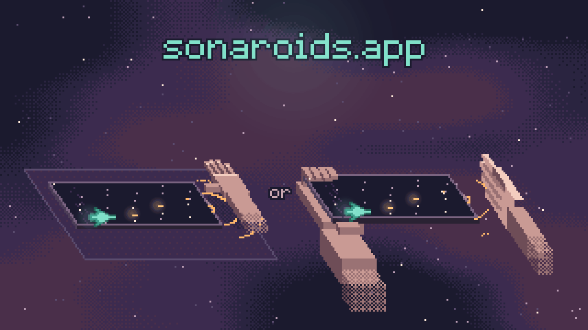

# Sonaroids

**English** · [Русский](README.ru.md)

A tiny retro space game for phones that you steer with your palm — **without touching the screen**.

<p align="center"></p>

The phone lies flat on the table — or sits in your other hand. It plays an inaudible ultrasonic tone through its own speaker and listens to the echo with its own microphone. How far your palm is from the phone becomes the height of your ship: a palm above the lying phone, or a palm at the end of the held one. The ship fires on its own — you only choose where to be.

**▶ Play: [sonaroids.app](https://sonaroids.app)** — on iPhone from the Home Screen; on Android best in the app (the link is on the game's title screen, or [the latest release](https://github.com/neokrasav4ik/sonaroids/releases/latest/download/sonaroids.apk)).

## How to play

1. Turn the phone sideways and lay it on the table, screen up — or hold it in your other hand, screen up.
2. Set the **media volume** to 20–30% (the silent switch doesn't matter).
3. Pick the probe: **wide** (cleaner control; children and pets may hear it) or **normal** (silent, slightly rougher control). The game asks before every game, there is no default.
4. Allow the microphone. Take your hand away for a moment — the game listens to the empty room.
5. Wave your palm up and down **5–10 cm above the table**, beside the phone — or, with the phone in your hand, move your palm, edge down, **5–15 cm from the phone's end** with the charging port (closer means lower). Don't cover the speaker or the microphone. The game fits the screen to your range, then shows the real ship following your palm — check the top and the bottom, and play (or recalibrate).
6. Fly: dodge the rocks, stay in the middle for more points, catch power-ups.

A game lasts a few minutes: the pace keeps growing, and a hand held in the air gets tired too — that's part of it.

## The game

- **Rocks** split into smaller ones when hit: large → two medium → two small.
- **Points by height:** the middle of the screen ×3, then ×2, the edges ×1; plus a **streak** multiplier for hits in a row (up to ×4).
- **Power-ups** — fly into them: shield (takes one hit), triple shot, slow motion (once the game has sped up), and a heart — an extra life (only after you've lost one, never above three).
- **Saucers:** a large one from level 2, a small one that aims at you from level 4. They sidestep when you line up with them; the large one takes two hits.
- **Pause menu:** go on, start over (straight away or recalibrate), end the game, exit, and the sound row.
- **Sounds:** "- SOUNDS ▮▮▮▮▮▮▯▯ +" in the menu and in the pause — 8 levels, a tap in the middle switches them off and on. If the game's own sounds get too loud for the microphone, it turns them down by itself.
- **High scores:** today, this week, all time. Every game is on a freshly generated layout. The first time a game makes the table, the game asks for a name (Latin letters, digits, `_`).

In flight the screen shows only the score and, small in the top corner, sonaroids.app — no labels, no numbers popping up. The picture is drawn at low resolution in whole pixels, with soft light on top; graphics, sounds and the 5×7 pixel font are all made in code.

## Phones

**iPhone** works well in Safari. On **Android** the phone's speaker and microphone decide how well the 16–20 kHz band gets through, and in a browser the page doesn't control the rest: which microphone records (on some Xiaomi phones the one at the port or the one at the front camera, launch to launch) and how loud the phone plays. That is what **the Android app** is for (`android/`): a thin shell over the same site — the game in it is the site's and updates by itself — that records and plays the sound itself. Before a game it tries the phone's built-in microphones in about two seconds and keeps the steadiest and cleanest one for this phone (the bottom microphone and the VOICE_RECOGNITION source unless another is clearly better), sets the media volume to about 25% and adjusts it by measurement, and switches the phone's own noise suppression, gain control and echo cancelling off. The app updates itself: "Update" downloads the new build and opens the phone's installer.

With the app and the wide probe a **Mi 9 Lite** (2019) plays like an iPhone, on the table and in the hand. A **Redmi Note 10S** is still fussy: its microphone sits by the speaker, and the palm is heard reliably only within about 10 cm. Earlier, in a browser: OnePlus 13 — poor on the table, but held in the hand almost as good as an iPhone; the notes games send to the server show the palm heard on Galaxy S25, Pixel 8 Pro, Nothing Phone (3a), realme GT Neo 5 and Honor 600 Lite; OnePlus 9 Pro is too quiet. The game learns which end of the phone your hand should be at, lights that edge up while you wave, and says so if it can't hear the palm. Details: `docs/design.md`, section 2.

If the palm isn't heard, a **long press on the version** (in the corner of the screen) shows "Logs": they record what the phone heard, and can be attached to an issue.

## How the sonar works, in short

- The probe is a periodic multi-tone signal: 512 samples at 48 kHz, 23 tones from 18.4 to 20.4 kHz (the normal probe) or 48 tones from 16 to 20.5 kHz (the wide probe). An AudioWorklet delivers the microphone stream sample-exact, so the echo picture is computed coherently every 10.7 ms.
- The wider the band, the finer the distance: about 8 cm for the normal probe, about 4 for the wide one. Against a ruler the wide probe followed the palm about twice as cleanly (spread 2.2 mm against 5.3).
- Palm **motion** comes from the phase change of the echo (sub-millimetre, but it drifts); palm **position** comes from where the echo sits compared with the empty room (noisy, but it doesn't drift). The two are fused: motion drives the ship, position keeps it from wandering.
- The echo is measured against the direct sound's own level; on phones whose speaker fades toward 20 kHz the band is equalized; if the phone drops a stretch of input, the direct sound is found again.
- With the phone in the hand the whole echo picture sometimes jumps in time at once, with no gap in the input (by 256 samples on an iPhone, ~144 on a OnePlus). When the direct sound disappears, the sonar looks for a shifted copy of the whole response, gathered over a third of a second so that the moving palm's echo cancels out, and moves there. Only if there is none is the speaker taken as covered, and the game says so.
- No separate calibration: before each game you take your hand away (the empty room), then wave — and the screen is fitted to your range.
- The sonar hears one thing: how far the palm is. With one microphone (all Safari gives — its second channel is empty) a palm moved left or right by the same amount sounds the same; a second speaker doesn't help either — with the microphone open, the iPhone's other channel reaches the microphone about 60 times weaker and from the same place as the bottom speaker. Two palms, a fist and a palm, a near and a far hand don't separate either: one microphone only tells that both hands move in step. The lab tried all of it in September 2026; a stereo recording through the Android app is next.

Measurements, experiments and what didn't work: `lab/HANDOVER.md` (Russian).

## High scores and fair play

A game is sent to the server not as a score but as the game itself: the layout number and the palm height at every step (a few KB). The flight is deterministic — fixed 60 Hz steps, a seeded random generator, no transcendental functions — so the server replays it with the very same code (`src/13_core.js`) and stores only a score that repeats. The player is a random key kept on the phone; the server stores only its hash. With each game goes a short note on the phone — iOS or Android, the kind of browser, the model on Android, the app or a browser and whose sound, which probe, the media volume, how well it heard the probe — to see where the sonar works; no user agent string or IP is stored. The server is plain Node + SQLite: `server/`.

## Repository

| path | what's inside |
|---|---|
| `src/` | the game's source in numbered parts; `build.py` joins them into one file, `game/play/index.html` |
| `game/` | the published site: `index.html` sends visitors straight into the game, `play/` — the game (built file, icons, manifest, service worker), `proto/` — the style prototype (unlinked), `font.js`, `robots.txt` |
| `server/` | the high-score server (api.sonaroids.app): `server.js`, backups, systemd unit, Caddy/nginx configs. Install: `server/README.md`, in Russian `docs/ru/server.md` |
| `android/` | the Android app: a WebView shell over sonaroids.app/play/ with its own sound (`NativeAudio.java`), volume, file saving and self-update; built on GitHub Actions into the latest release (`android/README.md`, in Russian) |
| `tests/` | the game's and the server's checks: `sh tests/run.sh` |
| `lab/` | the sonar lab: the test app `lab/app/sonar_lab3.html` (published unlinked at `/lab/sonar_lab3.html`; in the Android app it opens from the service screen), its sources and offline benches, and recordings for trying new ways to steer (the phone upright, the palm to the side, two speakers); notes in Russian |
| `font/` | the 5×7 pixel font (Latin and Cyrillic): `font5x7.txt` is the drawing, `make_font.py` packs it into `game/font.js` |
| `promo/` | the GIFs, drawn by the game's own code: `sonaroids_both_table.gif` (above — both ways, with the table and the holding hand), `sonaroids.gif` (both ways, only the phones and the palms), `sonaroids_table.gif`, `sonaroids_hand.gif`; all of them: `sh promo/make_all.sh` |
| `docs/` | the design document `design.md` (Russian original in `docs/ru/`), the server install guide in Russian |

### The game's code (`src/`)

| part | what it does |
|---|---|
| `00_head.html`, `99_end.html` | the page around the script |
| `10_worklet.js`, `11_dsp.js` | microphone frames and the echo processing (DSP2) — the same code as in the lab |
| `12_tune.js` | fitting the screen to the waved palm range (pure, tested in Node) |
| `13_core.js` | the flight and the rules, deterministic, with the rules tag the server checks |
| `20_sonar.js` | speaker and microphone: probe (normal / wide), side check, auto level and media volume, getting ready; in the Android app — the app's own sound and the microphone test; `Sonar.simulate()` feeds synthetic frames in tests |
| `21_log.js` | setup and game logs (WAV + JSON) for analysis with the lab's tools |
| `22_sfx.js` | event sounds, all below 6 kHz so they stay out of the probe's band |
| `23_net.js` | the high-score client: sends a game, the name, reads the tables |
| `30_lang_en.js`, `31_lang_ru.js` | interface strings |
| `40_gfx.js`, `41_sprites.js`, `42_guide.js`, `49_main.js` | drawing, sprites, first-launch pictures, screens and the game loop |

## Building and checks

```sh
python3 build.py                 # src/ → game/play/index.html (python3 font/make_font.py after changing the font)
python3 build.py --icons         # redraw the home-screen icons (needs Pillow)
sh tests/run.sh                  # the game and the server
cd lab && sh tools/run_all.sh    # the sonar lab
```

Node 22.13+ (the server uses `node:sqlite`) and Python 3. The screen and full-game checks run the game in headless Chromium with a synthetic microphone and a fake high-score server; they need Playwright and are skipped without it. GitHub Actions runs the checks on every push to `main` and publishes the site only if they pass.

The game's version is in `VERSION` (shown on the title screen and written into the logs); `CHANGELOG.md` says what each version changed. When a change alters play, the rules tag in `src/13_core.js` changes too, and the server is updated together with the site.

## License

MIT — see `LICENSE`.
