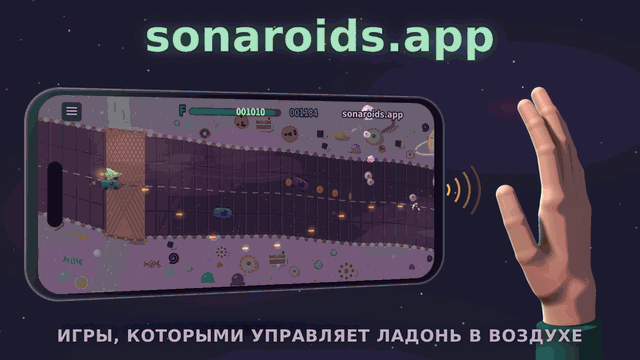
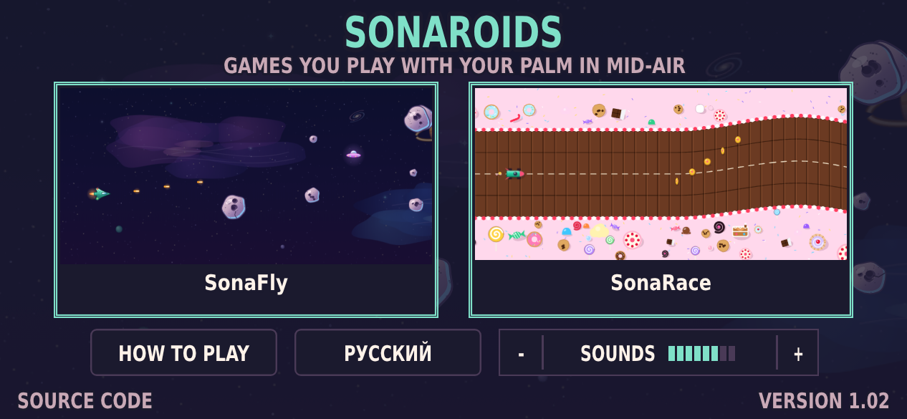
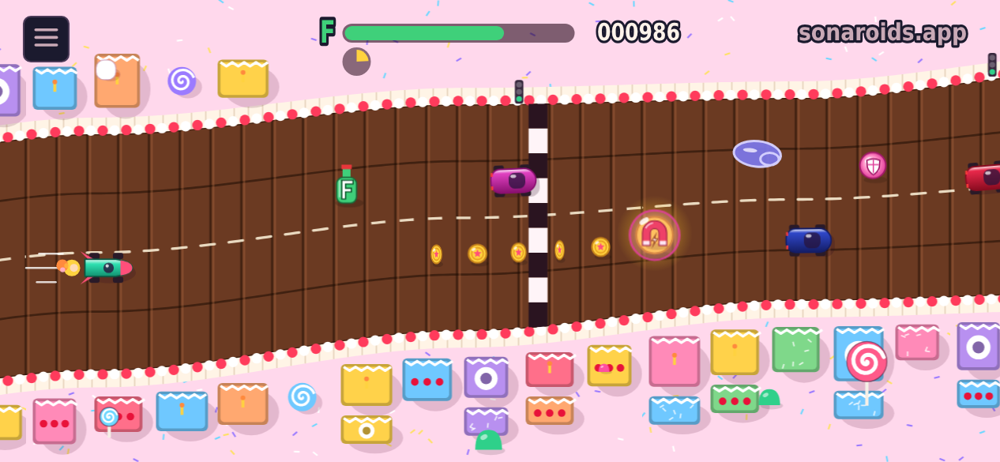
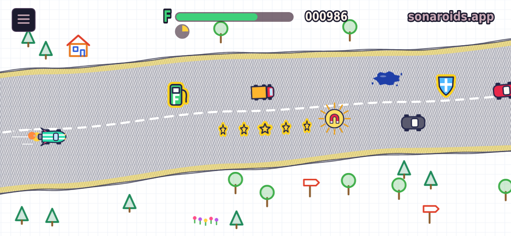

# sonaroids.app

[English](README.md) · **Русский**

<p align="center"></p>

**Игры, которыми управляет ладонь в воздухе.** Экрана касаться не нужно: телефон пускает через свой динамик неслышный ультразвук, слушает эхо своим микрофоном и узнаёт, как далеко ладонь. Это расстояние и становится высотой корабля или машинки. Камера не нужна, дополнительные устройства тоже, ставить ничего не надо — это просто страница в браузере.

**▶ Играть: [sonaroids.app](https://sonaroids.app)**
- **iPhone:** открой в Safari и добавь на экран «Домой».
- **Android:** лучше в приложении — [скачать APK](https://github.com/neokrasav4ik/sonaroids/releases/latest/download/sonaroids.apk) (ссылка есть и на экране игр).

## Игры

<p align="center"></p>

### SonaFly — стрелялка в космосе

Корабль стреляет сам, от тебя нужно одно: где ему быть.

- **Астероиды** от попадания раскалываются: большой → два средних → два маленьких.
- **Очки** зависят от высоты: середина экрана ×3, дальше ×2, края ×1. Попадания подряд дают ещё множитель **серии**, до ×4.
- **Бонусы** — в них надо влететь: щит (держит один удар), тройной выстрел, замедление (когда игра уже разогналась), сердце (лишняя жизнь, если одну уже потерял).
- **Тарелки:** большая со 2-го уровня, маленькая прицельная — с 4-го. Если встать с ними на одну линию, они уходят в сторону.
- **Шесть скинов:** космос, сказка, вектор 80-х, неон, тетрадка, ретро LCD — каждый в **HD** или в **пикселях**. В любом скине предметы нарисованы ровно того размера, каким их считает игра.

### SonaRace — гонка по извилистой дороге

<p align="center"> </p>

Машинка едет сама и постепенно разгоняется, а ладонь ведёт её поперёк дороги.

- **Топливо** уходит на ходу. Подбирай бутылочки с буквой **F** (в тетрадке это заправки); кончилось топливо — кончилась гонка.
- **Монетки** (в тетрадке звёздочки): вся линия целиком стоит дороже. Очки дают и за каждый обгон.
- **Удар о машину** тормозит и отнимает топливо. Тормозят ещё обочина и лужа сиропа (в тетрадке клякса), но если задеть лужу самым краем, ничего не будет.
- **Подарки:** магнит притягивает монетки и подарки, пузырь-щит выдерживает один удар. **Супер-приз** — турбо, магнит и щит сразу, он попадается ровно один раз на каждые восемь подарков.
- **Два скина:** конфетная страна и тетрадка, каждый в HD или в пикселях. Руль: по дороге (так по умолчанию — машинка держит своё место поперёк дороги и на поворотах) или по высоте.

## Как играть

Есть два способа:

| на столе | в руке |
|---|---|
| Телефон лежит боком экраном вверх, ладонь ходит вверх-вниз **в 5–10 см над столом** рядом с ним | Телефон в одной руке, другая ладонь ребром вниз ходит **в 5–15 см от торца с зарядкой** |

1. Поставь **громкость мультимедиа** на 20–30% (на iPhone 40–60%). Если игра пишет, что телефон не слышит свой звук, выключи бесшумный режим — он может глушить игру.
2. Выбери зонд. **Широкий** даёт управление чище, но его могут слышать дети и животные. **Обычный** не слышно совсем, зато он чуть грубее. Игра спрашивает перед каждой игрой.
3. Разреши микрофон и убери руку на секунду: игра запомнит, как звучит пустая комната.
4. Помаши ладонью. Ближе к телефону — корабль ниже, дальше — выше. Не закрывай динамик и микрофон. Игра подгонит экран под твой размах и покажет настоящий корабль (или машинку), который повторяет за ладонью. Проверь верх и низ — и можно играть.

Одна игра длится несколько минут: темп растёт, а рука в воздухе тоже устаёт — это часть игры.

**Пауза** в обеих играх: продолжить, начать заново (сразу или с новой подгонкой), закончить игру, выйти в меню. Рядом скин, графика (HD или пиксели) и звуки «- ЗВУКИ ▮▮▮▮▮▮▯▯ +»: восемь уровней, тап посередине выключает и включает. Скин и графику можно менять прямо посреди игры. Если звуки самой игры слишком громкие для микрофона, игра убавит их сама.

**Если что-то не так:** тап по номеру версии на экране игр перезагружает страницу, а долгое нажатие открывает «Журналы». Там записано, что слышал телефон; их можно приложить к issue.

## Телефоны

**iPhone** хорошо играет в Safari.

На **Android** многое зависит от самого телефона: насколько хорошо его динамик и микрофон пропускают звук 16–20 кГц. В браузере страница не может выбрать, какой микрофон пишет, и не знает, насколько громко играет телефон. Для этого и сделано **приложение** (`android/`). Внутри оно показывает тот же сайт, поэтому игры в нём всегда свежие, но звук пишет и играет само:
- перед игрой за пару секунд пробует встроенные микрофоны и оставляет самый устойчивый;
- ставит громкость по замеру;
- выключает шумоподавление, автоусиление и эхоподавление телефона;
- обновляется само.

С приложением и широким зондом **Mi 9 Lite** (2019 года) играет как iPhone. По запискам, которые игры шлют на сервер, ладонь слышна на Galaxy S25, Pixel 8 Pro, Nothing Phone (3a), realme GT Neo 5 и Honor 600 Lite. OnePlus 13 плохо слышит на столе, но в руке почти как iPhone. Redmi Note 10S надёжно слышит ладонь только ближе ~10 см. OnePlus 9 Pro слишком тихий. Игра сама определяет, у какого конца телефона должна быть рука, и говорит, если ладонь не слышна. Подробно: `docs/ru/design.md`, раздел 2.

## Рекорды и честная игра

У каждой игры свои таблицы: за сегодня, за неделю и за всё время. Когда игра впервые попадает в таблицу, она спрашивает имя (латиница, цифры, `_`). Код переноса переносит имя и рекорды в другой браузер или на другой телефон.

На сервер уходит не счёт, а сама игра: номер раскладки и высота ладони на каждом шаге, несколько КБ. Обе игры детерминированы — ровные шаги 60 раз в секунду, случайные числа из зерна, никаких трансцендентных функций. Поэтому сервер переигрывает каждую игру тем же кодом (`src/13_core.js` для SonaFly, `src/14_race.js` для SonaRace) и сохраняет счёт, только если он повторился.

Игрок — это случайный ключ в телефоне, сервер хранит только его хэш. С игрой идёт короткая записка о телефоне: iOS или Android, какой браузер, модель (на Android), какой зонд, громкость, насколько хорошо слышен зонд. Это нужно, чтобы видеть, где сонар работает. Строку браузера и IP сервер не сохраняет. Сервер — простой Node + SQLite, лежит в `server/`.

## Как работает сонар

- **Зонд** — повторяющийся многотоновый сигнал: 512 отсчётов при 48 кГц, 23 тона от 18,4 до 20,4 кГц (обычный) или 48 тонов от 16 до 20,5 кГц (широкий). AudioWorklet отдаёт поток микрофона с точностью до отсчёта, и картина эха считается каждые 10,7 мс.
- **Чем шире полоса, тем точнее расстояние:** около 8 см у обычного зонда, около 4 см у широкого. На замере по линейке широкий вёл ладонь примерно вдвое ровнее (разброс 2,2 мм против 5,3).
- **Движение и положение.** Движение ладони берётся из сдвига фазы эха: точно до долей миллиметра, но со временем уплывает. Положение — из того, где эхо стоит относительно пустой комнаты: шумно, зато не уплывает. Одно сливается с другим: движение ведёт корабль, положение не даёт ему уплыть. Пока идёт игра, картина пустой комнаты не обновляется, чтобы неподвижная ладонь не «растворилась» в фоне.
- **Поправки на телефон.** Эхо меряется относительно громкости прямого звука. Если динамик телефона слабеет к 20 кГц, полоса выравнивается. Если телефон теряет кусок звука или вся картина эха сдвигается во времени (так бывает, когда телефон в руке), прямой звук находится заново.
- **Чего сонар не умеет.** Он слышит только, как далеко ладонь. С одним микрофоном (больше Safari не даёт) движение влево и вправо звучит одинаково, и две руки тоже не различить. Лаборатория проверила всё это в сентябре 2026 года; записи — в `lab/HANDOVER.md`.

## Для разработчиков

### Что где лежит

| путь | что внутри |
|---|---|
| `src/` | исходники игр по пронумерованным частям; `build.py` собирает их в один файл `game/play/index.html` |
| `game/` | сайт: `index.html` ведёт в игры, `play/` — сами игры (собранный файл, иконки, манифест, service worker), `font.js`, `robots.txt` |
| `server/` | сервер рекордов (api.sonaroids.app): `server.js`, копии базы, сводка, служба systemd, настройки Caddy и nginx. Установка — `server/README.md`, по-русски `docs/ru/server.md` |
| `android/` | приложение для Android: WebView над sonaroids.app/play/ со своим звуком, громкостью, сохранением файлов и самообновлением. Собирается на GitHub Actions в последний выпуск (`android/README.md`) |
| `tests/` | проверки игр и сервера: `sh tests/run.sh` |
| `lab/` | лаборатория сонара: тестовое приложение `lab/app/sonar_lab3.html`, его исходники, стенды и записи |
| `font/` | пиксельный шрифт 5×7 (латиница и кириллица): `font5x7.txt` — сам рисунок, `make_font.py` упаковывает его в `game/font.js` |
| `promo/` | гифки и картинки из этого README, снятые с настоящих игр (см. ниже) |
| `docs/` | проектный документ (`docs/ru/design.md`, перевод — `docs/design.md`) и инструкция по серверу |

### Код игр (`src/`)

| часть | что делает |
|---|---|
| `00_head.html`, `99_end.html` | страница вокруг скрипта |
| `10_worklet.js`, `11_dsp.js` | кадры микрофона и обработка эха — тот же код, что в лаборатории |
| `12_tune.js` | подгонка экрана под размах ладони |
| `13_core.js` | SonaFly: полёт и правила; детерминированно, с меткой правил, которую проверяет сервер |
| `14_race.js` | SonaRace: дорога, машины, подарки и правила; детерминированно, со своей меткой правил |
| `20_sonar.js` | динамик и микрофон: зонд, проверка стороны, уровни и громкость, подготовка; свой звук приложения Android |
| `21_log.js` | журналы подготовки и игры (WAV + JSON) для инструментов лаборатории |
| `22_sfx.js` | звуки игры — все ниже 6 кГц, чтобы не мешать зонду |
| `23_net.js` | клиент рекордов: отправляет игру и имя, читает таблицы |
| `30_lang_en.js`, `31_lang_ru.js` | тексты интерфейса |
| `40_gfx.js`, `41_sprites.js`, `42_guide.js` | рисование, пиксельные спрайты, нарисованные телефоны в подготовке и инструкции |
| `43_skins.js`, `45_hd.js`, `46_vecskins.js`, `47_pixskins.js`, `48_sizes.js` | скины SonaFly: пиксели, HD, скины из фигур; предметы того размера, каким их считает игра |
| `48_racehd.js`, `48_racenote.js` | конфетная страна и тетрадка SonaRace, в HD и в пикселях |
| `49_main.js` | экраны, меню и игровой цикл |

### Сборка и проверки

```sh
python3 build.py                 # src/ → game/play/index.html (после правки шрифта — python3 font/make_font.py)
python3 build.py --icons         # перерисовать иконки для экрана «Домой» (нужен Pillow)
sh tests/run.sh                  # игры и сервер
cd lab && sh tools/run_all.sh    # лаборатория сонара
```

Нужны Node 22.13+ (сервер использует `node:sqlite`) и Python 3. Проверки экранов и целых игр гоняют обе игры в Chromium без окна, с синтетическим микрофоном и поддельным сервером рекордов. Для них нужен Playwright; без него эти проверки пропускаются. При каждой проверке боты проезжают больше сотни гонок SonaRace, чтобы длина и сложность гонки оставались такими, как настроены. GitHub Actions запускает проверки на каждый push в `main` и публикует сайт, только если они прошли.

Версия записана в `VERSION`: она видна на экране игр и пишется в журналы. В `CHANGELOG.md` сказано, что и зачем менялось в каждой версии. Если изменение меняет саму игру, меняется и метка правил в `src/13_core.js` или `src/14_race.js`, а сервер обновляется вместе с сайтом.

### Гифки и картинки

Всё снято с настоящих игр в Chromium без окна (нужен Playwright):

```sh
NODE_PATH=$(npm root -g) node promo/make_promo.js && python3 promo/make_promo.py   # гифки сверху: promo/sonaroids_en.gif, sonaroids_ru.gif (+ *_full.gif, 800×450)
NODE_PATH=$(npm root -g) node promo/make_shots.js                                  # картинки игр: promo/games.png, sonarace_*.png
sh promo/make_all.sh                                                               # старые пиксельные гифки (стол и рука)
```

Для гифок ещё нужны numpy, Pillow и ffmpeg. Ладонь в них нарисована кодом (`promo/promo_hand.py`), а игры на экране идут по-настоящему — их ведёт та же ладонь.

## Лицензия

MIT — см. `LICENSE`.
